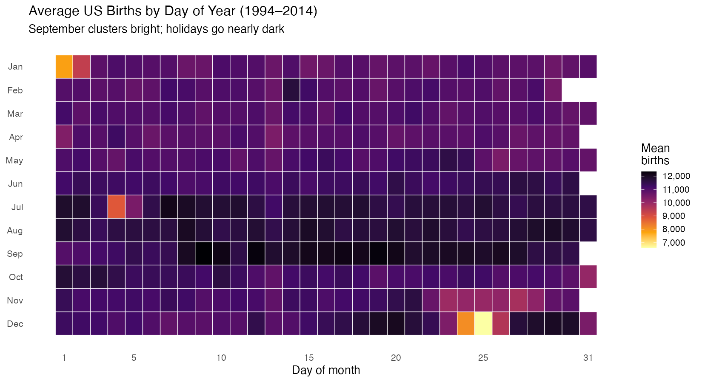
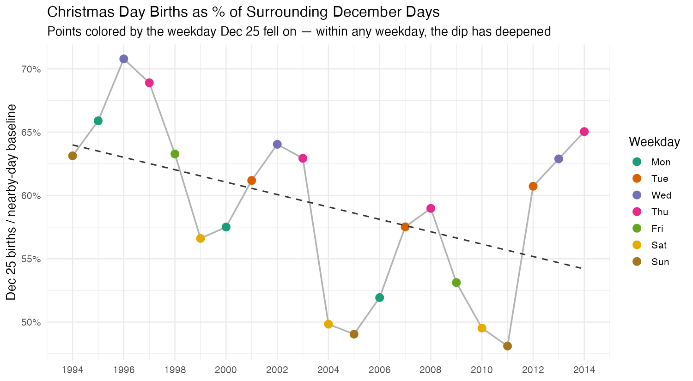
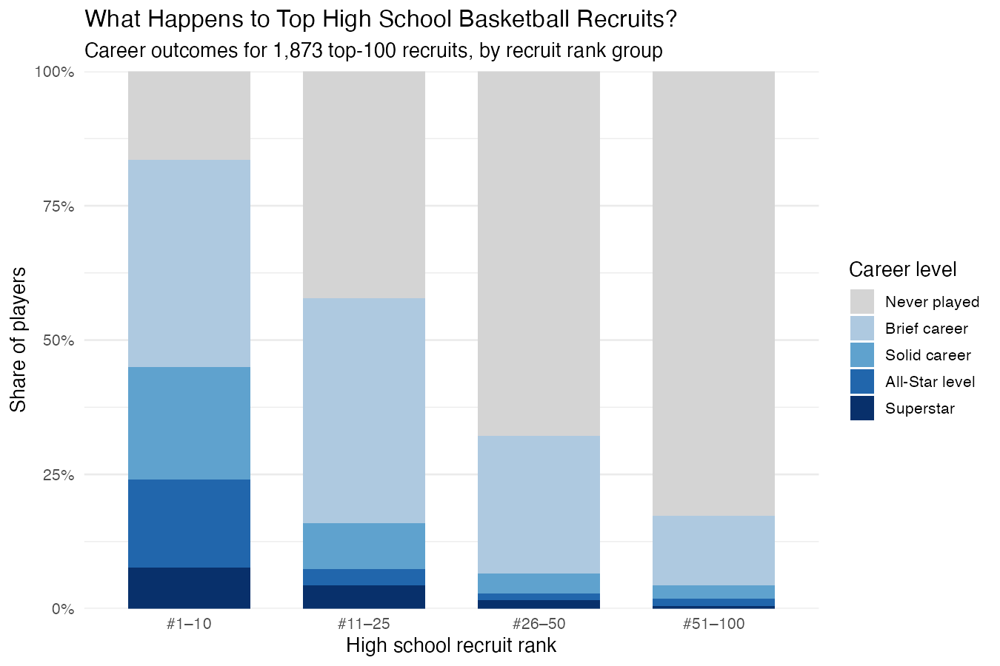
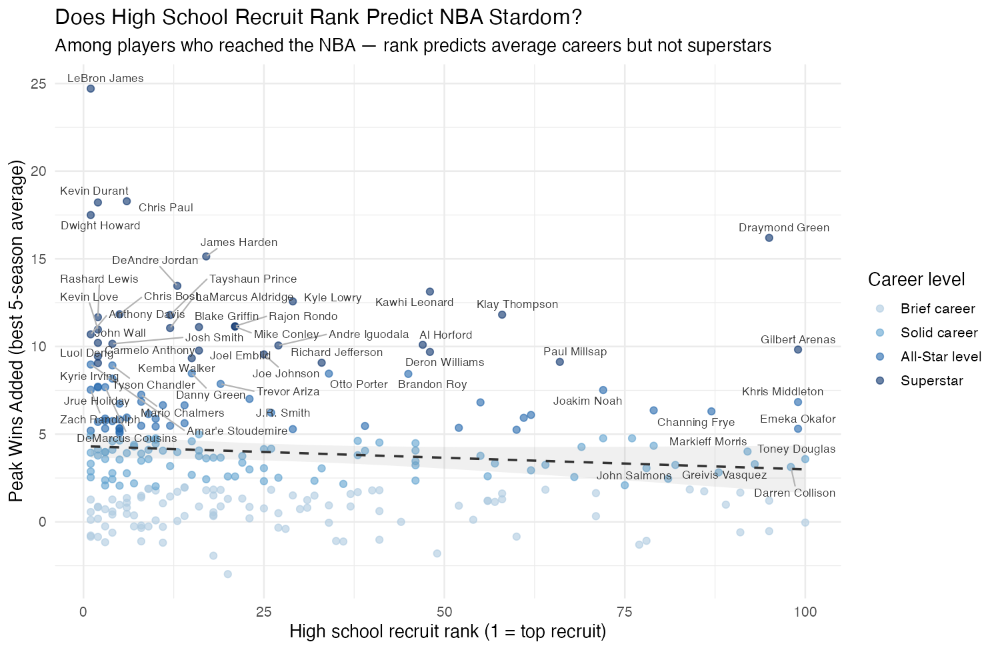
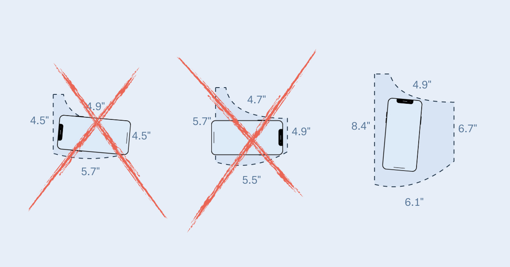
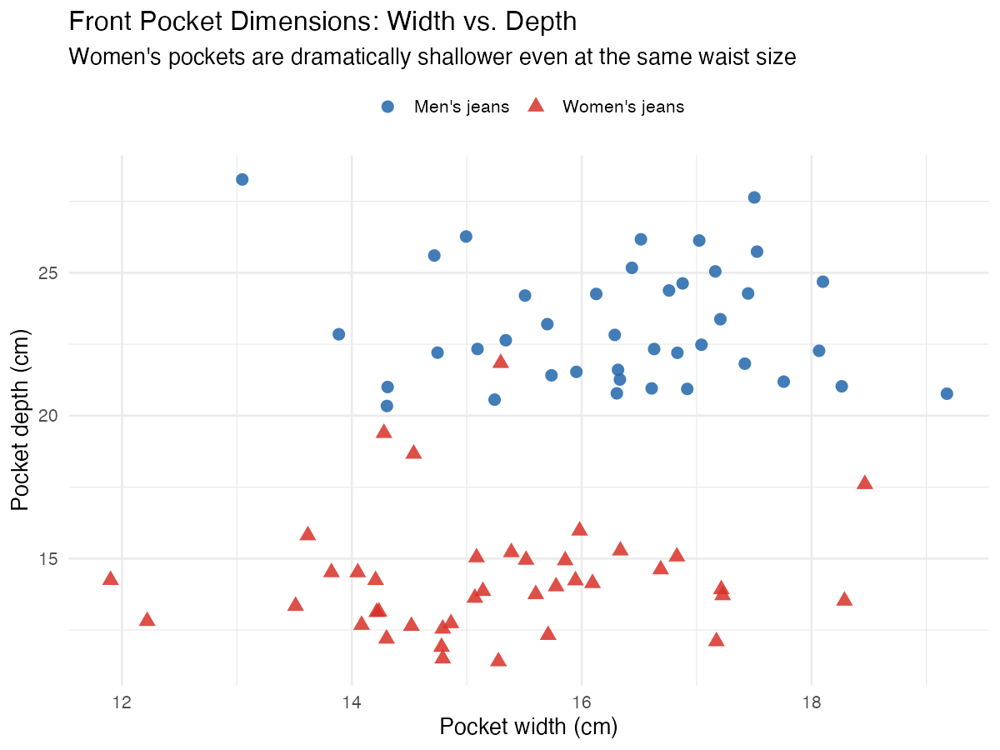
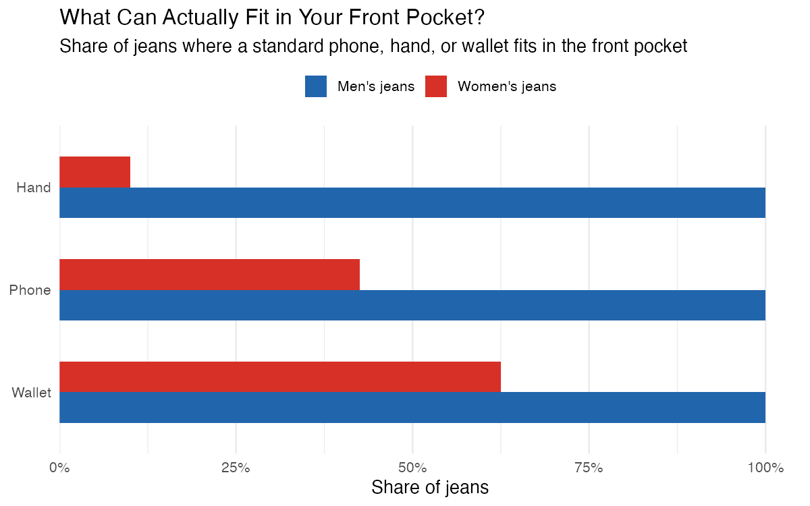

```{r setup}
#| include: false
library(knitr)
```

These three datasets were found by starting from a compelling published graphic, then checking whether the underlying data was available and whether there was a genuine mystery students could solve. Each entry below shows the original inspiring image, the tutorial path students would follow, and two rough section artifacts generated from the actual data.

---

## US Daily Births {#births}

**Source:** FiveThirtyEight — [*Some People Are Too Superstitious to Have a Baby on Friday the 13th*](http://web.archive.org/web/20260301025221/https://fivethirtyeight.com/features/some-people-are-too-superstitious-to-have-a-baby-on-friday-the-13th/) (2016) *(FiveThirtyEight is defunct — Wayback Machine link)*

::: {.columns}

::: {.column width="40%"}
**Original graphic**

```{r}
#| fig-alt: "FiveThirtyEight cover image for the births article showing a heatmap of US birth patterns"
knitr::include_graphics("../graphics/source-images/us-births-heatmap.png")
```

*Data: `fivethirtyeight` R package — ~7,700 rows, 1994–2014, one row per calendar day. Loads in one line, no API key.*
:::

::: {.column width="55%" style="padding-left: 2rem;"}
**The mystery**

The Christmas dip is easy to see — Dec 25 averages only 55% of surrounding days. But when you try to show the dip is *growing* over two decades, the year-over-year chart looks noisy and inconclusive.

Then you color the points by the weekday Christmas fell on, and everything snaps into focus: weekends already have 40% fewer births than Tuesdays regardless of any holiday, because scheduled deliveries cluster on weekdays. A Christmas on Sunday looks far worse than a Christmas on Tuesday just from that effect.

Same-weekday comparisons reveal the real trend — Sunday Christmases went from 63% to 49% to 48% of baseline (1994 → 2005 → 2011). The mechanism: C-sections and inductions rose from ~20% to ~32% of US births over this period, giving families increasing ability to opt out of unwanted dates.

**Rough tutorial path**

1. Load and combine two overlapping birth datasets from the `fivethirtyeight` package
2. Compute mean births by month × day; build the calendar heatmap
3. Name what you see — the September cluster, the holiday notches
4. Quantify the Christmas dip vs. surrounding days
5. Plot Dec 25 births by year — first attempt looks noisy
6. Color points by weekday — the confound becomes visible
7. Compare same-weekday Christmases across years to confirm the trend
8. Interpret: scheduled deliveries let families choose and avoid dates
:::

:::

### Section 1 Artifact — The Birth Calendar

```{r}
#| fig-cap: "Average US births by day of year, 1994–2014. September lights up; holidays go dark. Students build this with geom_tile on a month × day grid."
#| out-width: "100%"

```

### Section 2 Artifact — The Growing Holiday Dip

```{r}
#| fig-cap: "Dec 25 births as a share of nearby December days, by year. Points are colored by the weekday Christmas fell on — the confound that makes the naive plot look noisy. Within any weekday, the dip has deepened since the 1990s."
#| out-width: "100%"

```

---

## NBA Recruit Hype {#nba}

**Source:** The Pudding — [*How Many High School Stars Actually Make It in the NBA?*](https://pudding.cool/2019/03/hype/) (2019)

::: {.columns}

::: {.column width="40%"}
**Original graphic**

```{r}
#| fig-alt: "The Pudding social preview image for the NBA hype article"
knitr::include_graphics("../graphics/source-images/nba-hype.jpg")
```

*Data: The Pudding GitHub — 1,873 players, 30 columns including recruit rank, career stats (Wins Added, VORP), draft info, and seasons played.*
:::

::: {.column width="55%" style="padding-left: 2rem;"}
**The mystery**

The funnel is sobering: 54% of top-100 high school recruits never played a single NBA game. And the higher your rank, the better your odds of having a real career. Recruit rank looks like a reliable predictor.

Until you get to "Superstar."

Stephen Curry was not a top-100 high school recruit — he doesn't even have a rank in the dataset. Draymond Green was #95. Klay Thompson was #58. Among players who made it to the NBA, the correlation between recruit rank and peak performance is just **−0.09**. Rank predicts average careers but has almost nothing to say about who becomes elite.

The second plot makes this visible: the distribution of superstars across recruit ranks is nearly flat. Students who expect a tight negative slope see something much flatter — and then have to explain why.

**Rough tutorial path**

1. Load `players.csv`; inspect the career stat columns
2. Classify each player into a career tier based on peak Wins Added
3. Compute how many players from each recruit group (top 10, 11–25, 26–50, 51–100) reached each tier
4. Build the stacked bar funnel — rank clearly predicts making the NBA at all
5. Ask: does rank predict becoming a *superstar*?
6. Filter to NBA players; plot recruit rank vs. peak performance
7. Compute the correlation — students expect something large; −0.09 is the surprise
8. Label the famous outliers (Curry, Green, Thompson); interpret what rank actually measures
:::

:::

### Section 1 Artifact — The Career Funnel

```{r}
#| fig-cap: "Career outcomes for 1,873 top-100 high school recruits, by recruit rank group. Being a top-10 recruit dramatically improves your odds of reaching the NBA — but even then, more than half end up with brief careers or none at all."
#| out-width: "100%"

```

### Section 2 Artifact — Rank vs. Peak Performance

```{r}
#| fig-cap: "Among players who made it to the NBA, recruit rank barely predicts peak Wins Added (r = −0.09). Draymond Green (#95), Klay Thompson (#58), and Gilbert Arenas (#99) are among the top performers. The trendline is nearly flat."
#| out-width: "100%"

```

---

## Women's Pocket Sizes {#pockets}

**Source:** The Pudding — [*Women's Pockets Are Inferior*](https://pudding.cool/2018/08/pockets/) (2018)

::: {.columns}

::: {.column width="40%"}
**Original graphic**

```{r}
#| fig-alt: "The Pudding social preview image for the Women's Pockets article"

```

*Data: The Pudding GitHub — 80 pairs of jeans, 20 brands, controlled for waist size. Two files: raw measurements CSV + pre-computed functional fit JSON.*
:::

::: {.column width="55%" style="padding-left: 2rem;"}
**The mystery**

The scatter reveals the first surprise immediately: pocket *width* is nearly identical between men's and women's jeans (~16 cm vs ~15 cm). It's the *depth* that's dramatically different — men's pockets average 23 cm deep; women's average 14 cm. Same waist size, 62% shallower pocket.

But even that understates it. The second step uses functional fit data (pre-computed using phone, hand, and wallet dimensions as reference objects): **100% of men's jeans can fit a standard phone. Only 42% of women's can.**

The key teaching point is what controls for what: waist size is matched across brands, so anatomy isn't the explanation. Students discover this is a design choice, not a biological constraint — and the data makes that case quantitatively.

**Rough tutorial path**

1. Load `measurements.csv` (80 rows, 16 columns); inspect the dimension columns
2. Compare mean pocket depth and width by gender — width is nearly equal; depth is not
3. Plot depth vs. width for all 80 pairs, colored by gender — the clouds are in different quadrants
4. Notice that the separation is almost entirely vertical (depth), not horizontal (width)
5. Load the functional fit JSON; compute what share of pockets fit a phone, hand, wallet
6. Build the functional fit bar chart — the gap goes from large to stark
7. Interpret: matched waist size rules out anatomy; this is deliberate design
:::

:::

### Section 1 Artifact — Pocket Dimensions

```{r}
#| fig-cap: "Front pocket dimensions for 80 pairs of jeans across 20 brands. Pocket width (x-axis) is nearly identical between men's and women's jeans — the dramatic separation is vertical, driven entirely by depth."
#| out-width: "90%"

```

### Section 2 Artifact — What Actually Fits

```{r}
#| fig-cap: "Share of jeans where a standard phone, hand, or wallet fits in the front pocket. Every men's jean fits all three. Fewer than half of women's jeans can fit a phone; only 10% can fit a hand."
#| out-width: "90%"

```

### A Possible Direction: The Overlay

The original Pudding graphic does something more ambitious than a scatter. It renders every pair of jeans as a 2D rectangle — all 80 stacked on top of each other at a common anchor point — and then draws dashed outlines for a phone, a hand, and a wallet on top of the cloud. The effect is immediate and visceral: you see that the phone outline extends well below the bottom of most women's rectangles.

This is achievable in ggplot2 with `geom_rect()`, average-depth annotation lines, and reference object overlays. It requires no new data — just treating width and depth as box coordinates rather than scatter coordinates. The prototype below was generated from the same CSV used in Section 1.

This is more intermediate than a bar chart — students need to understand that `geom_rect()` takes `xmin`, `xmax`, `ymin`, `ymax` rather than `x` and `y`, and that centering the rectangles requires a small coordinate transform. Whether it belongs as the Section 2 final artifact or stays as instructor reference depends on how much geometry we want to introduce. If the tutorial is already teaching `geom_tile()` elsewhere, this is a natural next step. If not, the functional fit bar chart tells the same story more directly.

---

*All artifacts above were generated from the actual underlying data. Source images are from the original publications.*
