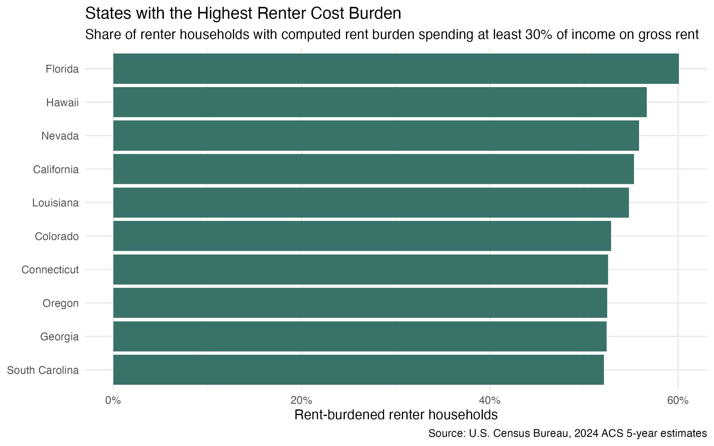
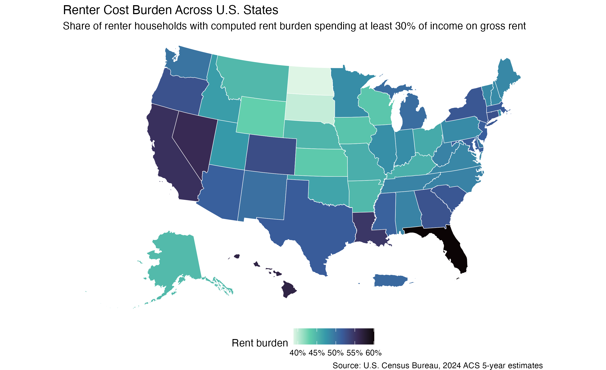
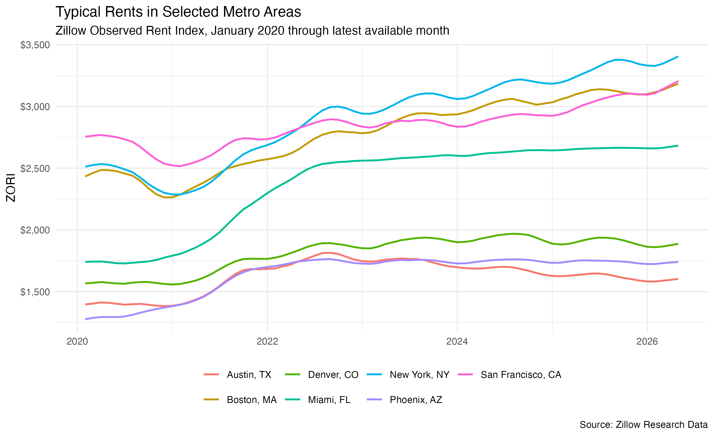
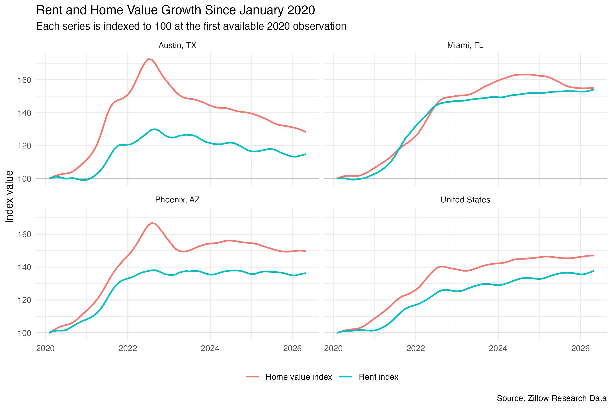
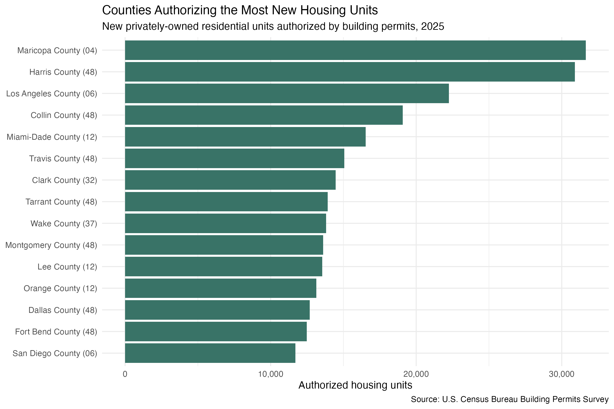
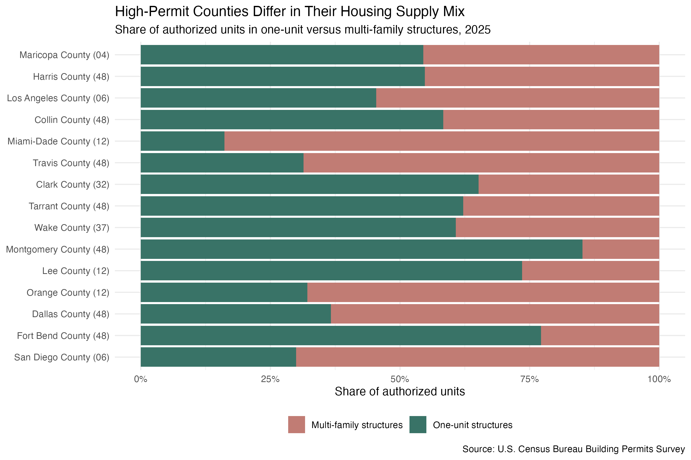
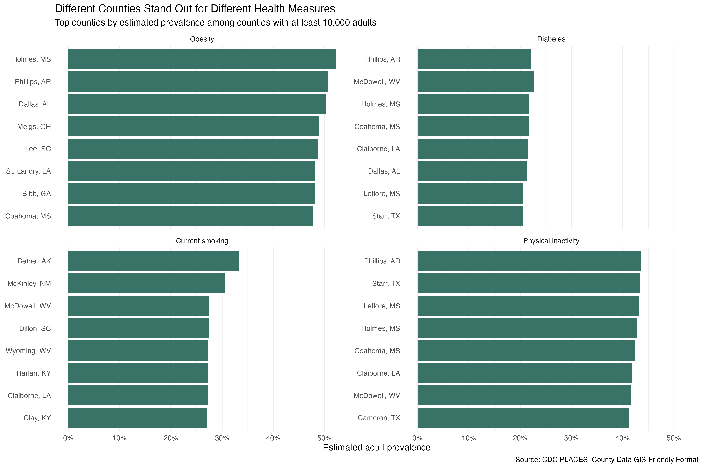
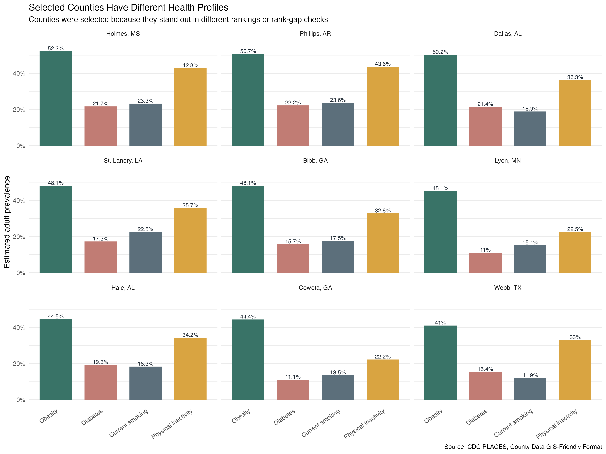

```{r}
library(dplyr)
library(readr)
library(knitr)

show_table <- function(data, caption) {
  kable(data, caption = caption, digits = 2)
}
```

## Purpose

This brief summarizes the dataset explorations that look most promising for new tutorials. Each candidate is organized around the same review questions:

1. What is the data source?
2. What cleaned table would students use?
3. What would happen in each tutorial section?
4. What artifacts would students produce?
5. What is the main story or mystery?

Consider: whether the dataset supports students using AI to do data science, with a clear learner path, a compelling question, durable source data, and a final artifact that says something meaningful.

## Topics

The table below lists each candidate dataset. Each row covers a single source and describes what information it contains.

<style>
  #topics-table { border-collapse: collapse; width: 100%; }
  #topics-table th, #topics-table td { border: 1px solid #ccc; padding: 6px 10px; }
</style>

<table id="topics-table">
<thead>
  <tr><th>Topic</th><th>Source</th><th>What the data covers</th></tr>
</thead>
<tbody>
  <tr>
    <td rowspan="4">Housing</td>
    <td>US Census ACS</td>
    <td>State and county estimates of rent, household income, home values, renter counts, and cost burden.</td>
  </tr>
  <tr>
    <td>Zillow</td>
    <td>Monthly metro-level rent and home value indexes tracking market trends over time.</td>
  </tr>
  <tr>
    <td>US Census Building Permits Survey</td>
    <td>County-level counts of authorized residential construction units broken down by structure type.</td>
  </tr>
  <tr>
    <td>HUD</td>
    <td>Federal housing assistance records including fair market rents, voucher counts, and subsidized units.</td>
  </tr>
  <tr>
    <td rowspan="3">Public Health</td>
    <td>CDC</td>
    <td>Model-based county-level estimates of health behaviors and outcomes including obesity, diabetes, smoking, and physical inactivity.</td>
  </tr>
  <tr>
    <td>County Health Rankings</td>
    <td>Annual county rankings combining health outcomes, behaviors, clinical care, and social and economic factors.</td>
  </tr>
  <tr>
    <td>State and local health departments</td>
    <td>State-specific surveillance data on disease incidence, vital statistics, and environmental exposures.</td>
  </tr>
  <tr>
    <td rowspan="3">Climate and Weather</td>
    <td>NOAA</td>
    <td>Historical weather station observations including temperature, precipitation, and storm event records.</td>
  </tr>
  <tr>
    <td>NASA</td>
    <td>Satellite-derived climate data covering global surface temperatures, sea levels, and atmospheric conditions.</td>
  </tr>
  <tr>
    <td>EPA</td>
    <td>Air quality index measurements and emissions records by county and monitoring station.</td>
  </tr>
  <tr>
    <td rowspan="3">Sports Analytics</td>
    <td>Lahman baseball database</td>
    <td>Complete historical MLB statistics covering players, teams, salaries, and awards from 1871 to present.</td>
  </tr>
  <tr>
    <td>baseballr</td>
    <td>Modern MLB Statcast and sabermetric data accessible via the Baseball Savant API.</td>
  </tr>
  <tr>
    <td>Basketball and soccer datasets</td>
    <td>Player and team performance statistics for NBA, soccer leagues, and other sports with varying historical coverage.</td>
  </tr>
  <tr>
    <td rowspan="4">Finance and Crypto</td>
    <td>Yahoo Finance</td>
    <td>Daily price, volume, and return data for stocks, ETFs, and major market indexes.</td>
  </tr>
  <tr>
    <td>FRED</td>
    <td>Federal Reserve economic time series including interest rates, inflation, GDP, and employment indicators.</td>
  </tr>
  <tr>
    <td>CoinGecko</td>
    <td>Historical price, volume, and market cap data for Bitcoin and thousands of other cryptocurrencies.</td>
  </tr>
  <tr>
    <td>Nasdaq Data Link</td>
    <td>Curated financial and alternative datasets covering equities, futures, and economic indicators.</td>
  </tr>
  <tr>
    <td rowspan="4">Transportation</td>
    <td>Bureau of Transportation Statistics</td>
    <td>National statistics on airline on-time performance, freight movement, highway safety, and transit ridership.</td>
  </tr>
  <tr>
    <td>NYC flights data</td>
    <td>On-time performance records for flights departing New York area airports.</td>
  </tr>
  <tr>
    <td>NHTSA crash data</td>
    <td>Federal records of U.S. traffic fatalities, crashes, and vehicle safety defects.</td>
  </tr>
  <tr>
    <td>Local transit open data</td>
    <td>City-level GTFS feeds and ridership counts for bus, rail, and other transit systems.</td>
  </tr>
  <tr>
    <td rowspan="3">Education</td>
    <td>College Scorecard</td>
    <td>Federal database of college costs, graduation rates, post-graduation earnings, and student demographics.</td>
  </tr>
  <tr>
    <td>National Center for Education Statistics</td>
    <td>Comprehensive K–12 and postsecondary data including enrollment, test scores, and school characteristics.</td>
  </tr>
  <tr>
    <td>State education departments</td>
    <td>State report cards, assessment results, and district-level education statistics.</td>
  </tr>
</tbody>
</table>

## Housing

The housing candidates are strong in different ways. They all stay close to a recognizable policy problem, but each one teaches a different kind of analysis that students can drive with AI while they focus on the question, the comparison, and the interpretation.

### ACS Housing Affordability

#### Data Source

The American Community Survey from the U.S. Census Bureau provides state-level estimates related to rent, income, home values, and renter cost burden. The prepared exploration uses 2024 ACS 5-year state estimates.

The tutorial story is about the difference between rent levels and rent burden. Florida ranks highest by renter cost burden in this extract even though Hawaii and California have higher median gross rent.

#### Cleaned Table

```{r}
acs <- read_csv(
  "../explorations/acs-housing-affordability/outputs/acs_housing_affordability_states.csv",
  show_col_types = FALSE
)

acs |>
  select(name, renter_households_total, rent_burden_rate, median_gross_rent, median_household_income) |>
  arrange(desc(rent_burden_rate)) |>
  head(8) |>
  show_table("ACS prepared table: selected columns from top renter-burden states")
```

#### Tutorial Sections

Section 1 would teach students to rank states by `rent_burden_rate` and create a bar chart. This makes the first version of the story clear: rent burden is not the same as median rent.

Section 2 would introduce geometry and use the map-ready `.rds` file to create a choropleth map. This gives students a concrete reason to use AI to get the analysis-ready data into map shape and to understand why `.csv` is enough for a table or bar chart while `.rds` preserves spatial geometry for mapping.

#### Artifacts






### Zillow Rent And Home Value Trends

#### Data Source

Zillow Research publishes housing market indexes such as ZORI for rent and ZHVI for home values. The exploration freezes selected metro-month data because Zillow updates monthly and says CSV paths can change.

The tutorial story is about comparing trends on a common indexed scale. Austin has relatively low rent growth since January 2020 among the selected metros, while its home-value growth is higher. Miami shows a different pattern, with both rent and home values growing strongly. The data work is useful, but the teaching point is the comparison, not the mechanics of moving columns around.

#### Cleaned Table

```{r}
zillow_latest <- read_csv(
  "../explorations/zillow-home-values-rents/outputs/zillow_metro_latest_growth.csv",
  show_col_types = FALSE
)

zillow_latest |>
  arrange(desc(rent_growth_since_2020)) |>
  head(8) |>
  show_table("Zillow prepared table: latest indexed rent and home-value growth")
```

#### Tutorial Sections

Section 1 would teach students to use AI to prepare the monthly rent series for plotting and create a rent trend line chart. This introduces time-series structure and source-specific vocabulary without making implementation the center of the lesson.

Section 2 would join rent and home-value series, index both measures to January 2020, and compare growth. This teaches why indexing is useful when two measures have different dollar scales and how to ask AI for a comparison that matches the question.

#### Artifacts






### Census Building Permits And Housing Supply

#### Data Source

The Census Building Permits Survey tracks privately owned residential construction authorized by building permits. The exploration uses final annual 2025 county estimates released on May 14, 2026.

The tutorial story is that housing supply is not only about the number of authorized units. Structure type matters. Maricopa and Harris authorize the most total units, while Miami-Dade has a much higher multi-family share. This gives students a clear place to use AI for summarizing and comparing the supply story.

#### Cleaned Table

```{r}
permits <- read_csv(
  "../explorations/building-permits-supply/outputs/building_permits_county_2025.csv",
  show_col_types = FALSE
)

permits |>
  select(county_name, total_units_est, units_1_units_est, multi_family_units_est, multi_family_share) |>
  arrange(desc(total_units_est)) |>
  head(10) |>
  show_table("Building permits prepared table: top counties by authorized units")
```

#### Tutorial Sections

Section 1 would rank counties by total authorized housing units and create a bar chart. This establishes the first supply story: where the most units are being authorized.

Section 2 would calculate or inspect `multi_family_share` and create a supply-mix chart. This changes the story from total volume to composition and gives students a reason to ask AI for a comparison that goes beyond a single rank.

#### Artifacts





## Public Health

### CDC PLACES County Health Profiles

#### Data Source

CDC PLACES provides model-based local public health estimates for counties and other geographies. The exploration uses a focused county extract with obesity, diagnosed diabetes, current smoking, and physical inactivity.

The tutorial story is that related public health measures are not interchangeable. Rankings show which counties stand out, correlations show measures are related, and selected county profiles show that local stories can differ.

#### Cleaned Table

```{r}
places <- read_csv(
  "../explorations/cdc-places-county-health/outputs/cdc_places_county_health_selected.csv",
  show_col_types = FALSE
)

places |>
  select(county_label, adult_population, obesity, diabetes, current_smoking, physical_inactivity) |>
  arrange(desc(obesity)) |>
  head(8) |>
  show_table("CDC PLACES prepared table: selected county health measures")
```

#### Tutorial Sections

Section 1 would rank counties separately for obesity, diabetes, current smoking, and physical inactivity. The artifact is a faceted bar chart showing that different counties stand out depending on the measure.

Section 2 would compare all six pairwise correlations, select interesting counties using top rankings and rank-gap checks, and create a grouped bar chart of county health profiles. The implementation can be handled with AI support, but the instructional focus is on which measures belong together and which counties tell a mixed story.

```{r}
correlations <- read_csv(
  "../explorations/cdc-places-county-health/outputs/pairwise_health_measure_correlations.csv",
  show_col_types = FALSE
)

correlations |>
  mutate(correlation = round(correlation, 3)) |>
  show_table("CDC PLACES pairwise correlations among selected measures")
```

#### Artifacts





```{r}
read_csv(
  "../explorations/cdc-places-county-health/outputs/pairwise_health_measure_correlations.csv",
  show_col_types = FALSE
) |>
  mutate(correlation = round(correlation, 3)) |>
  show_table("CDC PLACES: pairwise correlations among selected health measures")
```
